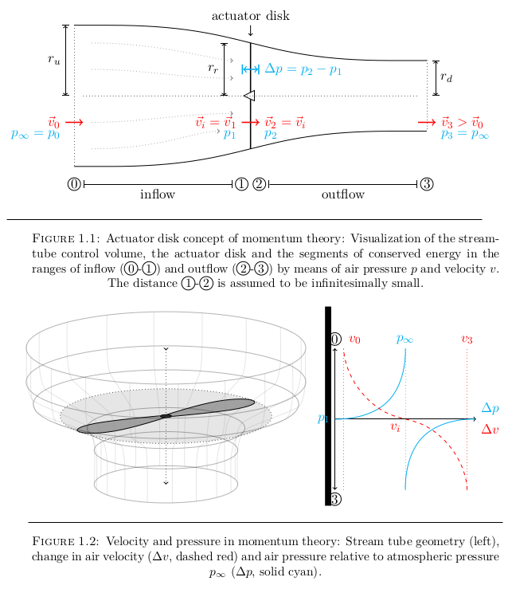

# Autonomous flight control of a quadrotor UAV using the STM32F3-Discovery microcontroller evaluation board

> This is old work in progress. It may act as an okay reference for technical documentation
> in LaTeX, but YMMV.

See the [latex/](latex/) directory for the main content.

    

